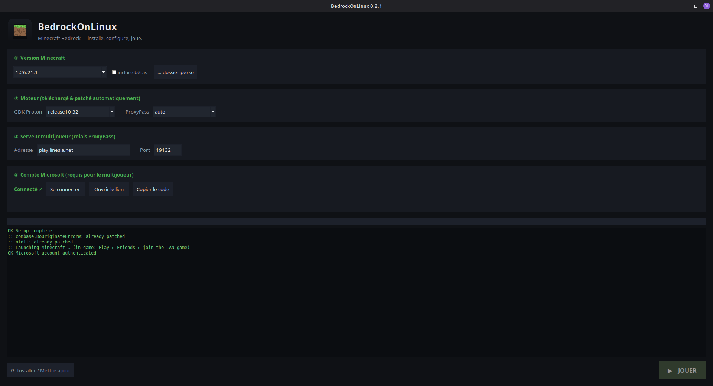

<div align="center">

# 🟩 BedrockOnLinux

**Minecraft Bedrock (édition Windows / GDK) sur Linux — multijoueur compris.
Une vraie appli : tu installes, tu choisis ta version, tu joues.**

`Ubuntu` · `Debian` · `Linux Mint / LMDE` · `Fedora` · `Arch` · `openSUSE`



</div>

---

## ✨ Ce que ça fait

Tout, à ta place, en une appli :

- 📦 télécharge **GDK‑Proton** et applique les **2 patchs binaires** sans
  lesquels le jeu ne démarre pas (`combase.RoOriginateErrorW` + tous les
  *stub funnels* de `ntdll`) ;
- 🧩 télécharge **umu‑launcher** (Steam Linux Runtime → marche sur toutes
  les distros), un **Java 25** embarqué et la **bonne build de ProxyPass** ;
- 🌐 lance **ProxyPass en arrière‑plan** pour le multijoueur (WineGDK n'a pas
  de login Microsoft *dans* le jeu — ProxyPass authentifie en dehors) ;
- 🎮 prépare le prefix Wine, curl/SSL, GameInput, `options.txt`, puis lance
  le jeu.

Tu choisis la **version Minecraft** (stable ou bêta), tu te **connectes à
Microsoft** (le code s'affiche dans l'appli), tu mets l'**IP du serveur**,
tu cliques **JOUER**.

## ⬇️ Installer

### Debian / Ubuntu / Mint — `.deb`

```bash
sudo apt install ./bedrock-on-linux_*_all.deb
```
Apt installe les dépendances tout seul. **BedrockOnLinux apparaît dans le
menu / la recherche** avec son icône.

### Toutes distros — `AppImage`

```bash
chmod +x BedrockOnLinux-x86_64.AppImage
./BedrockOnLinux-x86_64.AppImage
```

### Portable / autres distros — archive

```bash
tar xzf bedrock-on-linux-portable.tar.gz && cd bedrock-on-linux
./bedrock-on-linux gui          # ou: ./bedrock-on-linux doctor
```

> Prérequis (présents quasi partout) : `python3`, `python3-tk`, `tar`,
> `bubblewrap`, `zstd`. `bedrock-on-linux doctor` te dit ce qui manque et
> la commande pour l'installer.

## ▶️ Jouer

1. Ouvre **BedrockOnLinux**.
2. **① Version** : choisis (ex. `1.26.21.1`) — téléchargée pour toi.
3. **④ Compte Microsoft** → *Se connecter* : ouvre le lien affiché, entre
   le code, connecte le compte **qui possède Minecraft**.
4. **③ Serveur** : l'IP par défaut est `play.linesia.net` (modifiable).
5. **Installer / Mettre à jour**, puis **▶ JOUER**.
6. En jeu : **Jouer ▸ onglet Amis ▸ rejoins la partie LAN**
   *(le bouton « Ajouter un serveur » est grisé sous WineGDK : c'est normal,
   on passe par le LAN — ProxyPass fait le pont vers ton serveur).*

## 🩺 En cas de crash

L'appli **diagnostique automatiquement** : à la fermeture du jeu, la cause
probable s'affiche dans le journal (port occupé, GPU/Vulkan, version
ProxyPass, etc.). Bouton **🗎 Ouvrir les logs** pour tout voir
(`~/.local/share/bedrock-on-linux/logs/`). Cause fréquente déjà gérée :
plusieurs ProxyPass empilés → l'appli tue désormais les instances mortes
avant de relancer.

## 🧑‍💻 En ligne de commande

```bash
bedrock-on-linux versions                 # versions Minecraft dispo
bedrock-on-linux setup --mc 1.26.21.1     # installe cette version + tout
bedrock-on-linux config --server play.linesia.net:19132
bedrock-on-linux play
bedrock-on-linux doctor
```

## ⚖️ Légal

BedrockOnLinux **ne distribue aucun fichier Minecraft** : c'est un **lanceur
de compatibilité** (comme Heroic / mcpelauncher). Les fichiers de jeu
viennent d'une **source choisie par toi** (par défaut l'archive
communautaire
[`bubbles-wow/mcbe-gdk-unpack-archive`](https://github.com/bubbles-wow/mcbe-gdk-unpack-archive))
ou de ton propre dossier — tu dois posséder Minecraft. GDK‑Proton,
umu‑launcher, ProxyPass et Temurin sont libres, sous leurs licences
respectives. Realms / login Microsoft *natif dans le jeu* : non supportés
(limite WineGDK ; le multi serveurs passe par ProxyPass).

## 🛠️ Construire les paquets

```bash
scripts/build-release.sh        # .deb + AppImage + tar.gz portable dans dist/
```

Détails techniques (offsets des patchs, pourquoi) :
[`docs/ARCHITECTURE.md`](docs/ARCHITECTURE.md).

## 📄 Licence

MIT — voir [`LICENSE`](LICENSE).
